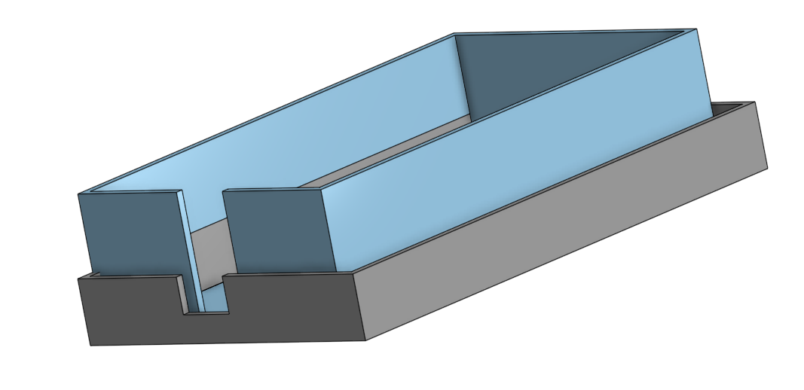

# cocktail-pumps

# Demo

[demo as mp4](https://github.com/user-attachments/assets/370c607c-63c9-449f-bd99-f4d8ec2cead2)

# Description

This project was developed in the context of the Cocktailmixer robot built by the Information Systems and Business Process Management chair at TUM. It builds upon earlier work by [Dominik Voigt](https://github.com/DominikVoigt/esp32-weightsensor) and Quirin Sailer.

The stated goal of this project was to implement a coherent system of weight cells and pumps which can be instructed by the [CPEE](https://arxiv.org/pdf/2208.12214) to mix various cocktails. This is achieved by utilizing 1 weight cell for the glass and 5 weight cells for each liquid which can then be pumped into the glass. The CPEE has access to individual weights and commands and can thus coordinate the asynchronous pumping, the fill level of the glass, the fill level of the liquids, etc with other processes of the cocktail robot.

# Setup

This is a quick introduction of how to get the current setup up and running. If you want more information on how to create this project, have a look at the [implementation](https://github.com/simonktum/cocktail-pumps/?tab=readme-ov-file#implementation).

0. Don't place anything on the weightcells yet
1. Connect the relays to power via a usb-c cable.
2. When the led lights up in red, press the button several times until the 15V mode is selected and the led lights in cyan. See [troubleshooting](https://github.com/simonktum/cocktail-pumps/?tab=readme-ov-file#troubleshooting) if it flashes or behaves otherwise.
3. Connect the pump esp by connecting it via a micro usb cable
4. If the esp for the weight cells was unplugged, remove the 5V and ground connections off the board and then plug the micro usb in to boot it. After around 7 seconds you can plug the 5V and ground connections back in.
5. Make sure the the aggregator script is running. You can test it by sending an http request to ``/pumps/weights``. Both esps should now be accessible to the CPEE via the aggregator  and ready to receive instructions.
6. Set the empty fill level by placing an empty bottle and sending a post to ``weights/<sensor-id>/empty``. Likewise, place a full bottle send a post request to ``weights/<sensor-id>/full`` to set the full weight. That allows you to receive the fill level with ``weights/<sensor-id>/level``.

## Limitations

There are some limitations in the current design:

- The esp for the loadcells occasionally reboots due to a [brownout](https://arduino.stackexchange.com/questions/76690/esp32-brownout-detector-was-triggered-upon-wifi-begin#76692) flag
- The wiring and inconsistent behavior of the ESP can be finicky (see [troubleshooting](https://github.com/simonktum/cocktail-pumps/?tab=readme-ov-file#troubleshooting))
- The loadcells can loosen over time because they are screwed directly into the 3d printed part

# Implementation

It the final implementation this project combines in total 6 load cells and 5 pumps. The materials for them are [here](/weightsensors/README.md) and [here](/pumps/ReadMe.md). The project also contains the CAD Files for all 3D printed parts which you can find [here](/docs/3D%20Prints/).

## CPEE Intetegration

The CPEE implementation can be found [here](/docs/CPEE/Cocktail_Pumps.xml).

The process starts by requesting the fill level of Sensor 1 which correspond to the fill level of the bottle place on the second weight cell. This is done thought a GET request to ``/weights/sensor_1113/level`` If the resulting fill level is larger than 10% a command is sent to the aggregator to fill the glass from pump 1 by 20 grams. The endpoint is a POST to ``/pumps/fill/0/20`` The aggregator script uses the ``CPEE-CALLBACK`` header to perform the filling filling of the glass asynchronous. The callback is sent once the glass is filled by the requested amount (in grams).

## Architecture

The esp controlling the weightsensors and the esp controlling the pumps are both sending and receiving instructions over the same MQTT Broker. The subscribed topics are ``cocktail/weight/+`` and ``cocktail/pumpen/``. The CPEE does not send MQTT instructions directly, instead it interfaces with an aggregator. This aggregator listens to updates on the MQTT topics and forwards instructions by the CPEE in the same topic channels. The aggregator provides a REST API to the CPEE which provides information about the current status of the sensors and possible instructions. It also holds the latest weight measured by each weight cell.

The documentation for the endpoints is in their respective sections below.

## Aggregator

The aggregator is a flask application found in ``weightsensors/src/aggregator``. It facilitates the communication between the ESPs and the CPEE. The specific endpoints are mentioned in the respective sections. There also two deployment scripts you might find useful.

- A the startup script for the aggregator found in ``weightsensors/src/aggregator``
- A simple moscitto MQTT broker in ``weightsensors/src/scripts``

## Weightsensors

The code is running on a [ESP-32 Dev Kit C V4](https://cdn.shopify.com/s/files/1/1509/1638/files/AZ282_A_19-2_DE_B08BTS62L7.pdf?v=1719330230) board and uses a HX711 Analog-To-Digital Converted (ADC) with the [olkal/HX711_ADC](https://github.com/olkal/HX711_ADC) implementation. The sensor measurements are sent via MQTT to an MQTT Broker and then aggregated and made available via a REST API by another MQTT Client (Python Paho/Flask).

The software of the weight cell is split up into two main components, the deploy code which runs the main program, and the calibrate code which can be used to find the calibration values. The sensor code is in the `weightsensors/src` directory. The aggregator code is in the `weightsensors/aggregator` subdirectory.
Like Dominik, I compiled the sensor code using PlatformIO which can be installed as a VS Code Extension.

Before the weight cell can be deployed using the `deploy.cpp` file, a couple of things have to be adapted in it.
If you manually noted down the factor, set `useEEPROM` to `false` and update the `calibrationValue` variable accordingly. If you saved it to EEPROM just set the `useEEPROM` to `true`. To connect to the WiFi, set the WiFi's `ssid` and `password` to the corresponding variables.
Lastly, to allow communication with the MQTT Broker you have to set the port (`port` variable) and IP Address (`server` variable) of the Mosquitto MQTT Broker. Note that if you use the `startupBroker` bash script in the `scripts` subdirectory, the port has to be equal to the `listener` entry in the `mosquitto.conf` file.

For more information, please look at Dominik's original Readme which can be found [here](https://github.com/DominikVoigt/esp32-weightsensor?tab=readme-ov-file).

### Wiring

While the color coding of the weight cell wires was consistent with the image, they can differ. To identify the pairs the most reliable way is to measure the resistance of each pair of wires (make sure to measure within the correct range to see the resistance values). Each of the correct pairs of wires should have a resistance of about 1000 Ohm and the other (wrong) pair combinations around 750-850 Ohm.

This is the wiring setup of a single weight cell. All cells follow this schema and are connected to the following pins:

- Cell 0 with DT = 4 and SCK = 16
- Cell 1 with DT = 2 and SCK = 15
- Cell 2 with DT = 5 and SCK = 17
- Cell 3 with DT = 19 and SCK = 18
- Cell 4 with DT = 32 and SCK = 33
- Cell 5 with DT = 12 and SCK = 14

 

### Calibration

Each load cell has to be calibrated with a calibration value which has to be found empirically. This can be done by selecting the `calibrate.cpp` in the `platformio.ini` file and then using the "Upload and Monitor" task to run the calibration program. When following the program either note the calibration factor down or save it to EEPROM.

### Aggregator Endpoints

- weights: Data of all sensors that data was aggregated on
- weights/\<sensor-id\>: Data of a particular sensor specified by the <sensor-id> can be seen under the name property of the weight endpoint
- weights/\<sensor-id\>/name: Name of the sensor, corresponds with \<sensor-id\>
- weights/\<sensor-id\>/weight: Latest published weight of the sensor
- weights/\<sensor-id\>/full: Weight of the completely filled container on the scale. Null if weight not set previously via a POST to this endpoint
- weights/\<sensor-id\>/empty: Weight of the completely empty container on the scale. Null if weight not set previously via a POST to this endpoint
- weights/\<sensor-id\>/level: Current fill level based on the weight of the container on the scale, requires full and empty to be set via the corresponding endpoints
- cocktail/weight/: Tares all weight cells to set the new zero point

The ESP listens to the following MQTT instruction:

- `TARE` Tares all weight cells to set the new zero point

The weightsensors can also output their readings to an OLED Display which was implemented by Dominik. However it is not used in this implementation.

### 3D Printed parts

You can find all STL files [here](/docs/3D%20Prints/).

The case for the load cell is an improved designed based on Dominik's original case. It is reduced to the 3 essential pieces:

1. A top cover to keep out water splashes. It needs to be installed onto the weight cell first.
2. A bottom cover which includes a slightly larger cable hole.
3. A bracket to hold the cell in place and connect it to other ones with dovetails

The dovetail connector includes a bracket to hold small cables.

The basic case houses the ESP and converters to save them from water splashes.

## Pumps

The pumps are controlled by a separate ESP, which controls up to 8 relays to drive them. The ESP receives the various commands over MQTT from the aggregator on the topic ``cocktail/pumpen``.

Like the the sensor esp code, you first need to set the correct wifi details and MQTT Broker address. All MQTT instructions can reference multiple pumps by including multiple numbers e.g. ``ON023-``. The trailing dash ensures no additional pumps are incorrectly identified.

The ESP listens to the following MQTT instructions:

- `ON12-` turns on relay 1 and 2 
- `OFF12-` turns off relay 1 and 2
- `BURST01-` turns on relay 0 for the fixed time of 1 sec
- `TIMED0AS2-` turns on relay 0 for the specified time in seconds, here 2 sec

The power to drive the relays is provided by a ZY12PDN board with the following [color indicators](https://github.com/manuelbl/zy12pdn-oss#usage-instructions):  

| Color  | Fixed Voltage |
| :----- | :-- |
| Red    | 5V  |
| Yellow | 9V  |
| Green  | 12V |
| Cyan   | 15V |
| Blue   | 20V |
| Purple | Configure fixed voltage mode with highest available voltage. |

The pumps can be driven with 15V or 20V, though I would recommend 15V since that is what I tested them with.

The remaining hardware was not implemented by me. Please check the original [Readme](/pumps/ReadMe.md) by Quirin Sailer for more information.

### Aggregator Endpoints

- /pumps/\<string:pump\>/burst: Run the specified pump for 1 second.
- /pumps/\<string:pump\>/timed/\<int:time\> Run the specified pump for a given amount of time in seconds.
- /pumps/fill/\<string:pump\>/\<int:amount\> Asynchronously fills the glass from the specified pump up to the amount specified in grams. Note: The script first checks if a weight is detected on sensor 0, i.e. the glass and will run the pump for a maximum of 10 times and otherwise abort.

### 3D Printed parts

Since the pumps were already developed, only the tube fixture was 3d printed by me and is provided here. You can find all STL files [here](/docs/3D%20Prints/).

The current, less than optimal, fixture for the tubes.

This is an alternative plate with the correct dimensions to hold up to 5 tubes with a diameter of 6 mm.

# Troubleshooting

To make this project easily reproducible here are some common issues I ran into:

## Weightsensors

- When flashing the esp fails because ``the wrong boot mode is detected`` you need to put it into download mode by pressing and holding the boot button on the board for 1-2 sec.
However this might still fail on the loadcell esp, in which case also disconnect 5V power and ground cables during boot and wait until the loadcells were initialized after the reboot.
- Similarly, if you encounter the error ``A fatal error occurred: Serial data stream stopped: Possible serial noise or corruption.``, disconnect the 5V power and ground connections.
- The mqtt message might look weird in some clients because of the byte order
- If the zero point of the loadcell is set incorrectly, you need to send a tare command by pressing t in the serial monitor
- The zero point might change unexpectedly if the weightcell esp experiences a brownout and reboots

## Pumps
- The power delivery for the pump relays is picky about the rotation of the usb-c cable. It the led does not illuminate, turn it by 180° and try again.
- The power delivery requires a 5V input first and then you can cycle through the power profiles by pressing the button
- If the power delivery led flashes you are either in configuration mode, or your input is unsuitable

You can use the following resources for troubleshooting the power delivery
- https://github.com/manuelbl/zy12pdn-oss
- https://www.alexwhittemore.com/notes-on-usb-pd-triggers-and-zy12pdn-instructions/
- https://goughlui.com/2021/08/31/quick-review-yzx-studio-zy12pdn-usb-c-pd-decoy-board/

## CPEE
- If the CPEE process is stopped because if encountered an HTTP response outside of 200-300, ensure that the aggregator script is running and does so on the correct port and endpoint

# Credits

The original weightcell implementation was done by [Dominik Voigt](https://github.com/DominikVoigt/esp32-weightsensor) and the pump system by Quirin Sailer.