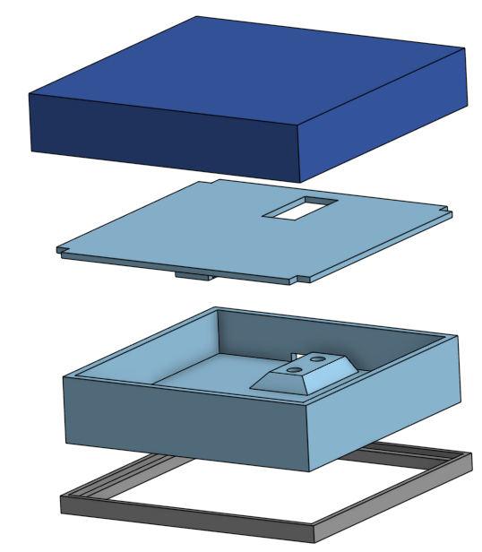

# Esp32-Weightsensor

## to add

- boot button needs to be pressed when the wrong boot mode is detected (put into download mode) "You have to push and hold the Boot button until you see "Connecting....." in the terminal window. Then release the button and it should load."
Also disconnect power and ground
- install the board driver
- configure the interface/connection port, display with pio device list
- uses https://github.com/olkal/HX711_ADC
- if the code upload fails, try unplugging the power connections (A fatal error occurred: Serial data stream stopped: Possible serial noise or corruption.)
- mqtt message might look weird in some clients, byte order
- power von einem ZY12PDN board

Pumpen
- bei der power delivery für die relays ist die Orientierung des usb-c kabel aus irgendeinem grund wichtig. wenn es nicht klappt, umdrehen und nochmal versuchen

## Demo

## Description

Load cells can provide very reliable weight-sensing data for a wide variety of industrial applications.

In the context of the Cocktailmixer robot built by the [Information Systems and Business Process Management](https://www.cs.cit.tum.de/bpm/chair/) chair at [TUM](https://www.tum.de/en/) there are a wide variety of applications for this such as presence sensing for a cocktail queue and the monitoring of fill level of different bottles used by the robot to mix cocktails.

Therefore goal of this project was to construct a proof of concept weight measurement cell using a 4-Wire Loadcell. The sensor measurement are read using a 24-bit ADC (HX711) by a Microcontroller (ESP-32) and sent via MQTT to an MQTT Broker (Mosquitto) and then aggregated and made available via a REST API by another MQTT Client (Python Paho/Flask).

## Features
This project allows deployment of an arbitrary number of weight measurement cells within the range of the configured WiFi and an aggregator that allows monitoring of the currently measured weight by each cell.

Additionally, it allows to monitor the fill level of a calibrated container placed on a load cell in percentage. For this the container has to be calibrated on the weight cell by measuring it in its weight when being full and when it is empty by invoking the corresponding `full` and `empty` POST endpoints in the REST API. 

For more details about the REST API capabilities see [here](#endpoints)

A small OLED Display provides on-site measurements for the connected weight cell.

The project also contains the CAD Files of the 3-D print casing for mounting the Load cell.

## Technical Section

### Bill of Material

- A 4-wire Load Cell - Note: In this case, a 3kg one was used but different cells have different dimensions and can thus require changes in the placement and dimensions of the mounting holes
- An HX711 Analog-To-Digital Converted (ADC)
- ESP-32 (WiFi capable)
- Breadboard
- 4 Male-Male Dupont Wires 
- 6 Female-Male Dupont Wires 
- OLED (128x64) Display that uses I2C Communication - note: Depending on the Display Driver (SH1106/SD1306) the object class for the `u8g2` object in the `deploy.cpp` might have to be adapted accordingly
- 3D Printer (For the Casing)
- Very Recommended ([Reason](#hardware-setup--wiring)): Male Dupont Pins and a corresponding Ratcheting Crimping tool 

### Hardware Setup & Wiring

Note that the Wires of the load cell are extremely thin and sensitive as they are stranded and not solid core wires and each stand is extremely thin. To make it easier to work with, crimp a Male Dupont Pin onto the end of each load cell wire.

Now it is important to check the configuration of the Load-Cell Wires. A 4-wire Load cell contains two pairs of wires. One pair should be connected to E+ and E- and the other to A+ and A-.
One pair is responsible for providing the current and the other for measuring the voltage over the [Wheatstone bridge](https://en.wikipedia.org/wiki/Wheatstone_bridge) that is created by the strain gauges on the load cell. Note that the order of the pairs does not matter as does the ordering of the two wires per pair (either wire of the first pair can be connected to E+ and the other one to E-).

To identify the pairs the most reliable way is to measure the resistance of each pair of wires (make sure to measure within the correct range to see the resistance values).
Each of the correct pairs of wires should have a resistance of about 1000 Ohm and the other (wrong) pair combinations around 750-850 Ohm.

In my case the wire pairs were black-red and white-green.
To make it easier I recommend to use a 4-pin Housing to hold all four Dupont pins of the wires together (put the wires of the pairs next to each other).

For the wiring follow this diagram (note that this corresponds to the case when the pairs are black-red and white-green (adapt this to your situation)):

### Software Setup - Sensor

The software is split up into two main components. The sensor code is directly in the `src` directory. The aggregator code is in the `aggregator` subdirectory.
The simplest way to get the sensor code compiling and running is to use PlatformIO which can be installed as a VS Code Extension.

When PlatformIO is installed just open the command palette (`Ctrl + Shift + P` when using the  standard VS Code keyboard shortcuts) and run the "Upload" or "Upload and Monitor" PlatformIO task.
This automatically compiles the code and uploads it to the connected ESP-32.

In the `src` folder, there are two sensor code files, `calibrate.cpp` and `deploy.cpp`.
To decide which of the files to compile and upload to the ESP change the `build_src_filter` property in the `platformio.ini` file within the root folder.

First, each load cell has to be calibrated, for this, the calibration value has to be found empirically. This can be done by selecting the `calibrate.cpp` in the `platformio.ini` file and then using the "Upload and Monitor" task to run the calibration program. When following the program either note the calibration factor down or save it to EEPROM.

Before the weight cell can be deployed using the `deploy.cpp` file, a couple of things have to be adapted in it.
If you manually noted down the factor, set `useEEPROM` to `false` and update the `calibrationValue` variable accordingly. If you saved it to EEPROM just set the `useEEPROM` to `true`.

If you want to see a TUM logo display on startup set the `enableBootDisplay` variable to `true`.

To connect to the WiFi, set the WiFi's `ssid` and `password` to the corresponding variables.
Lastly, to allow communication with the MQTT Broker you have to set the port (`port` variable) and IP Address (`server` variable) of the Mosquitto MQTT Broker. Note that if you use the `startupBroker` bash script in the `scripts` subdirectory, the port has to be equal to the `listener` entry in the `mosquitto.conf` file.

### Software Setup - Aggregator

Similar to the sensor, the Mosquitto MQTT Broker IP Address and port also have to be configured in the `aggregator.py` to enable the aggregator to connect to it for this change the `ipAddressMQTT` and `portMQTT` variables respectively.
Note that the `aggregator.py` makes use of the Paho and Flask libraries. To ensure a working environment you can create an environment and then run `pip install -r requirements.txt` from the root of the project.

### Run

To run the aggregator it is advisable to use the premade `startupAggregator.sh` script as it runs the aggregator directly using the flask run command that is essential for the aggregator to work correctly.

The sensors can be started at an arbitrary moment in time, but have to connect to the MQTT broker during startup.
The aggregator has to be started after Mosquitto MQTT Broker.
Thus the `startupBroker.sh` script should be run first and subsequently the `startupAggregator.sh` script should be run from a shell with the correct Python environment active

### Employed Technologies

To make the weight measurement cells small and cheap an ESP-32 controller was used for the Microcontroller as it  comes with out-of-the-box WiFi capabilities and is quite cheap.

To send the data to an aggregator the MQTT protocol is used as it is the SOTA protocol for IOT applications.

The aggregator that collects the sensor data was written using Python and the Paho and Flask libraries.
The Paho library is used to enable the aggregator to communicate with the MQTT Broker by acting as an MQTT client and subscribing to the sensor data of all weight measurement cells.
The Flask library allows the aggregator to expose the data of the different sensors via a simple and light weight REST API. Furthermore, the REST API enables the [monitoring of fill levels](#features) of bottles on a per-cell-basis.

### Endpoints

- weights: Data of all sensors that data was aggregated on
- weights/\<sensor-id\>: Data of a particular sensor specified by the <sensor-id> can be seen under the name property of the weight endpoint
- weights/\<sensor-id\>/name: Name of the sensor, corresponds with \<sensor-id\>
- weights/\<sensor-id\>/weight: Latest published weight of the sensor
- weights/\<sensor-id\>/full: Weight of the completely filled container on the scale. Null if weight not set previously via a POST to this endpoint
- weights/\<sensor-id\>/empty: Weight of the completely empty container on the scale. Null if weight not set previously via a POST to this endpoint
- weights/\<sensor-id\>/level: Current fill level based on the weight of the container on the scale, requires full and empty to be set via the corresponding endpoints
        

### 3-D printed Casing

To mount the Load Cell to the Casing, first mount the second plate from the top to the load cell and then mount the bottom casing to the load cell through the holes in the bottom.

The top casing should just slide on and of the top mounting plate (that was mounted first). If this is not the case maybe some sanding of the edges of the top mounting plate may be required.

### Credit

Code skeleton for weight measurements acquired from [here](https://github.com/olkal/HX711_ADC/blob/master/examples/Read_1x_load_cell_interrupt_driven/Read_1x_load_cell_interrupt_driven.ino)

WiFi and MQTT code skeleton acquired from [here](https://randomnerdtutorials.com/esp32-mqtt-publish-subscribe-arduino-ide/) 
